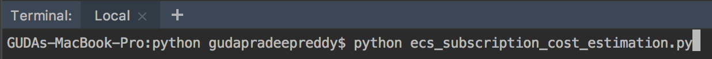
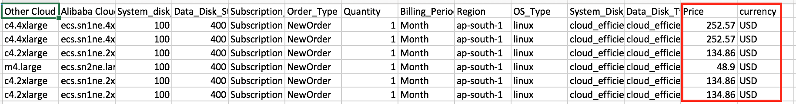

# Alibaba Cloud Billing API examples for ECS cost estimation using Python

## Summary
1. [Introduction](#introduction)

2. [Use Cases](#use-cases)
    1. [Usecase: ECS Subscription cost estimation based on the csv template](#usecase-ecs-subscription-cost-estimation-based-on-the-csv-template)
    2. [Usecase: ECS PayAsYouGo cost estimation based on the csv template](#usecase-ecs-payasyougo-cost-estimation-based-on-the-csv-template)

3. [Prerequisites](#prerequisites)
    1. [Setup Environment](#setup-environment)
    2. [Install Python](#install-python)
    3. [Install aliyun-python-sdk-bssopenapi on your local machine.](#install-aliyun-python-sdk-bssopenapi-on-your-local-machine)
    4. [Install beautifulSoup library for XML parsing.](#install-beautifulsoup-library-for-xml-parsing)
4. [Prepare ECS Cost Estimation CSV Templates](#prepare-ecs-cost-estimation-csv-templates)
    1. [ECS Subscription Cost Estimation csv Template](#ecs-subscription-cost-estimation-csv-template)
    2. [ECS PayAsYouGo Cost Estimation csv Template](#ecs-payasyougo-cost-estimation-csv-template)

5. [How to use Python code snippets](#how-to-use-python-code-snippets)
    1. [How to estimate ECS subscription cost](#how-to-estimate-ecs-subscription-cost)
    2. [How to estimate ECS PayAsYouGo cost](#how-to-estimate-ecs-payasyougo-cost)

## Introduction
This example shows how to use Alibaba Cloud Billing API using python for estimating ECS subscription or PayAsYouGo using csv template.
 
## Use Cases
We will demonstrate 2 use cases.
 
### Usecase: ECS Subscription cost estimation based on the csv template
This is a common use case where in there is a need to estimate Subscription cost (Monthly/Yearly) for large number of ECS based on different combinations (instance family,System Disk,Data Disk, Region, Disk type, duration(monthly, yearly) etc)
### Usecase: ECS PayAsYouGo cost estimation based on the csv template
This is a common use case where in there is a need to estimate PayAsYouGo cost (Monthly/Yearly) for large number of ECS based on different combinations (instance family,System Disk,Data Disk, Region, Disk type, duration(hourly, days) etc)

 
## Prerequisites
 
### Setup Environment
Set up python environment on your local machine (mac).

#### Install Python
```console
prompt:~$ brew install python
```
####  Install aliyun-python-sdk-bssopenapi on your local machine.
```console
prompt:~$ python -m pip install aliyun-python-sdk-bssopenapi
```
#### Install beautifulSoup library for XML parsing.
```console
prompt:~$ python -m pip install bs4
```
  
### Prepare ECS Cost Estimation CSV Templates
This particular Python Billing programs requires input in a certain format.
  
#### ECS Subscription Cost Estimation csv Template
Please use this template to pass in as input to python program for ECS subscription cost estimate.
##### Template name : 
[ecs_subscription_cost_estimation_template.csv](resources/ecs_subscription_cost_estimation_template.csv)
##### Template Type : 
Input File
##### Template Description :

  
#### ECS PayAsYouGo Cost Estimation csv Template
Please use this template to pass in as input to python program for ECS PayAsYouGo cost estimate.
##### Template name : 
[ecs_payasyougo_cost_estimation_template.csv](resources/ecs_payasyougo_cost_estimation_template.csv)
##### Template Type : 
Input File
##### Template Description :


   
## How to use Python code snippets
### How to estimate ECS subscription cost
* Make sure you have python environment setup and templates ready as mentioned in Step3.
* Copy ecs_subscription_cost_estimation.py & ecs_subscription_cost_estimation_template.csv to a folder.
* Update the code file with your respective keys (AccessKey ID,Access Secret Key) and save it.

    

* Execute python ecs_subscription_cost_estimation.py

    

* Check the out file ecs_subscription_cost_estimation_output_xxxxxxxxxxxxxx.csv with the cost.

    

    

### How to estimate ECS PayAsYouGo cost
* Make sure you have python environment setup and templates ready as mentioned in Step3.
* Copy ecs_payasyougo_cost_estimation.py & ecs_payasyougo_cost_estimation_template.csv to a folder.
* Update the code file with your respective keys (AccessKey ID,Access Secret Key) and save it. 

    

* Execute python ecs_payasyougo_cost_estimation.py

    

* Check the out file ecs_payasyougo_cost_estimation_output_xxxxxxxxxxxxxx.csv

    

    

    
   
  